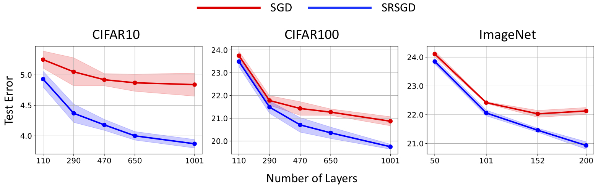
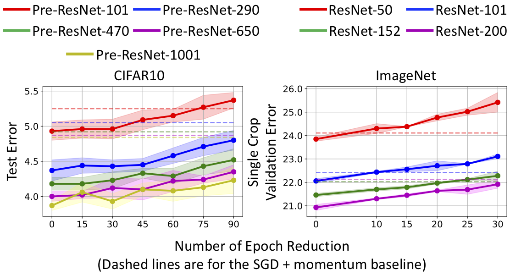

<h1 align="center">Scheduled Restart SGD</h1>
<h5 align="center">Scheduled Restart Momentum for Accelerated Stochastic Gradient Descent</h5>

<p align="center">
  
</p>

## Resources
[Paper](https://arxiv.org/abs/2002.10583), [Slides](https://drive.google.com/file/d/16Uu7QGB_6BPsFSXKbhmyyZWRVVIHJ-aC/view?usp=sharing), [Blog](http://almostconvergent.blogs.rice.edu/2020/02/21/srsgd)

## Key Results

<p align="center">
  
</p>
Figure 1: Error vs. depth of ResNet models trained with SRSGD and the baseline SGD with constant momemtum. **Advantage of SRSGD continues to grow with depth**.
<br/>
<br/>

<p align="center">
  
</p>
Figure 2: Test error vs. number of epoch reduction in CIFAR10 and ImageNet training. The dashed lines are test errors of the SGD baseline. On both CIFAR and ImageNet, **SRSGD reaches similar or even better error rates with fewer training epochs compared to the SGD baseline**.

## Requirements
This code is tested inside the NVIDIA Pytorch docker container release 19.09. This container can be pulled from NVIDIA GPU Cloud as follows:

`docker pull nvcr.io/nvidia/pytorch:19.09-py3`

Detailed information on packages included in the NVIDIA Pytorch containter 19.09 can be found at [NVIDIA Pytorch Release 19.09](https://docs.nvidia.com/deeplearning/frameworks/pytorch-release-notes/rel_19-09.html#rel_19-09). In addition to those packages, the following packages are required:

- Sklearn: `pip install -U scikit-learn --user`
- OpenCV: `pip install opencv-python`
- Progress: `pip install progress`

In order to reproduce the plots in our papers, the following packages are needed:

- Pandas: `pip install pandas`
- Seaborn: `pip install seaborn`

To run our code without using the NVIDIA Pytorch containter, at least the following packages are required:

- Ubuntu 18.04 including Python 3.6 environment
- PyTorch 1.2.0
- NVIDIA CUDA 10.1.243 including cuBLAS 10.2.1.243
- NVIDIA cuDNN 7.6.3
- [NVIDIA APEX](https://github.com/NVIDIA/apex)

## ImageNet Experiments Requires ImageNet Datasets in LMDB Format
Using the default `datasets.ImageFolder` + `data.DataLoader` is not efficient due to the slow reading of discontinuous small chunks. In order to speed up the training on ImageNet, we convert small JPEG images into a large binary file in Lighting Memory-Mapped Database (LMDB) format and load the training data with `data.distributed.DistributedSampler` and `data.DataLoader`. You can follow the [instructions](http://caffe.berkeleyvision.org/gathered/examples/imagenet.html) for Caffe to build the LMDB dataset of ImageNet. Alternatively, you can use these following two sets of instructions to build the LMDB dataset of ImageNet:[https://github.com/intel/caffe/wiki/How-to-create-ImageNet-LMDB](https://github.com/intel/caffe/wiki/How-to-create-ImageNet-LMDB) and [https://github.com/rioyokotalab/caffe/wiki/How-to-Create-Imagenet-ILSVRC2012-LMDB](https://github.com/rioyokotalab/caffe/wiki/How-to-Create-Imagenet-ILSVRC2012-LMDB).

The ImageNet LMDB dataset should be placed inside the directory `/datasets/imagenet` in your computer and contains the following files:

`fid_mean_cov.npz`  `train_faster_imagefolder.lmdb`  `train_faster_imagefolder.lmdb.pt`  `val_faster_imagefolder.lmdb`  `val_faster_imagefolder.lmdb.pt`

## SRSGD Optimizer
We provide the SRSGD class in `./optimizers/srsgd.py`. Our train functions in `cifar.py` and `imagenet.py`call `iter_count, iter_total = optimizer.update_iter()` after `optimizer.step()`.

## Code for Plotting Figures in Our Paper
We provide code for plotting figures in our paper in the jupyter notebook `plot_code_srsgd.ipynb`. For Figure 7 in the Appendix, we followed this github: `https://github.com/wronnyhuang/gen-viz/tree/master/minefield`. Instead of using SGD, we trained the model using SRSGD and plotted the trajectories. Since this visualization code took 2 or 3 days to finish, we didn't include it in `plot_code_srsgd.ipynb`. 

## Training
A training [recipe](recipes.md) is provided for image classification experiments (see `recipes.md`). The recipe contains the commands to run experiments for Table 1, 2, 3, 4 and 5 in our paper, which includes full and short trainings on CIFAR10, CIFAR100, and ImageNet using SRSGD, as well as the baseline SGD trainings. Other experiments in our paper and in the appendix can be run using the same `cifar.py` and `imagenet.py` files with different values of parameters.

## Citation
Please cite the following paper if you found our SRSGD useful. Thanks!

>Bao Wang, Tan M Nguyen, Andrea L Bertozzi, Richard G Baraniuk, and Stanley J Osher. "Scheduled Restart Momentum for Accelerated Stochastic Gradient Descent." arXiv preprint arXiv:2002.10583 (2020).

```
@article{wang2020scheduled,
  title={Scheduled Restart Momentum for Accelerated Stochastic Gradient Descent},
  author={Wang, Bao and Nguyen, Tan M and Bertozzi, Andrea L and Baraniuk, Richard G and Osher, Stanley J},
  journal={arXiv preprint arXiv:2002.10583},
  year={2020}
}
```

